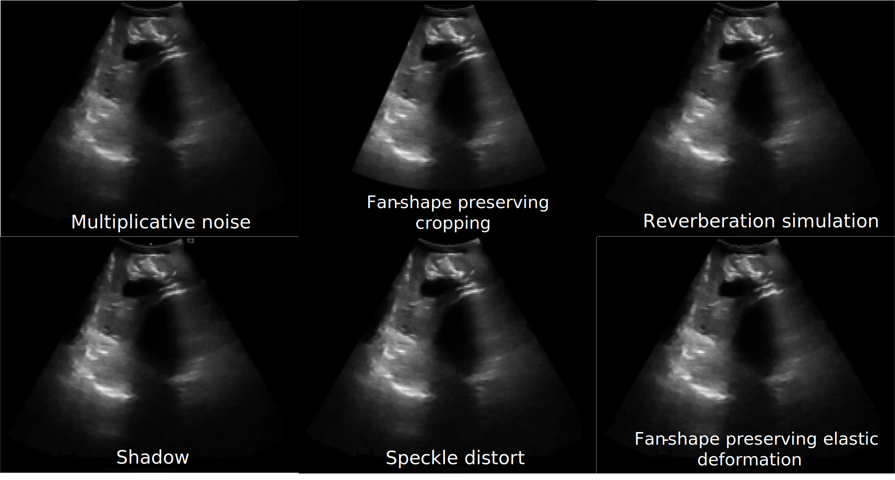

# UltraAugment
PyTorch implementation for paper **[UltraAugment: Fan-shape and Artifact-based Data Augmentation for 2D
Ultrasound Images](https://openaccess.thecvf.com/content/CVPR2024W/DCAMI/papers/Ramakers_UltraAugment_Fan-shape_and_Artifact-based_Data_Augmentation_for_2D_Ultrasound_Images_CVPRW_2024_paper.pdf)**, accepted at the *Data Curation and Augmentation in Enhancing Medical Imaging Applications* workshop at the *IEEE/CVF Conference on Computer Vision and Pattern Recognition 2024*.

If you happen use the code, please cite:

```
@InProceedings{Ramakers_2024_CVPR,
    author    = {Ramakers, Florian and Vercauteren, Tom and Deprest, Jan and Williams, Helena},
    title     = {UltraAugment: Fan-shape and Artifact-based Data Augmentation for 2D Ultrasound Images},
    booktitle = {Proceedings of the IEEE/CVF Conference on Computer Vision and Pattern Recognition (CVPR) Workshops},
    month     = {June},
    year      = {2024},
    pages     = {2422-2431}
}
```

## Overview


To run the code use the following command:
```
python -m train_seg_net path/to/config.json
```
For an example of a configuration file see the `configs` folder.
To run your own data, please take a look at `FH_SP_folds.csv` on how to specify image paths and labels.


## Requirements
**Python version**: 3.10
```
Package                           Version
--------------------------------- --------------------
einops                            0.7.0
itk                               5.3.0
matplotlib                        3.8.4
MedPy                             0.5.1
monai                             1.3.0
nibabel                           5.2.1
numpy                             1.26.4
opencv-python                     4.10.0.84
pillow                            10.2.0
scikit-image                      0.22.0
scikit-learn                      1.3.0
scipy                             1.12.0
SimpleITK                         2.3.1
tensorboard                       2.16.2
tensorboardX                      2.6.2.2
torch                             1.13.0+cu117
torchaudio                        0.13.0+cu117
torchvision                       0.14.0+cu117
tqdm                              4.65.0
```

